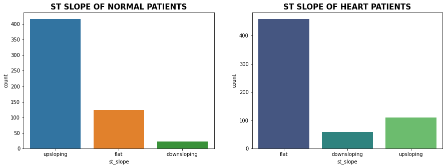

[![LinkedIn][linkedin-shield]][linkedin-url]

<!-- PROJECT LOGO -->
<br />
<div align="center">
  <a href="https://github.com/othneildrew/Best-README-Template">
    
  </a>

<h3 align="center">Heart Diease Classification <br>An End-to-End Machine Learning Project</h3>

  <p align="center">
    Developed and deployed a classifier for heart disease based on over 20 machine learning models, achieving an accuracy of 93.13% using the ExtraTreesClassifier100 model.
    
  </p>
</div>


<!-- TABLE OF CONTENTS -->
<details>
  <summary>Table of Contents</summary>
 <ol>
<li>About the project
<ol>
<li>Dataset Description</li>
<li>Libraries</li>
<li>Data Cleaning &amp; Preprocessing&nbsp;
<ol>
<li>Converting features to catetgorical values</li>
<li>Checking missing values</li>
</ol>
</li>
<li>Exploratory Data Analysis
<ol>
<li>Distribution of heart disease&nbsp;</li>
<li>Gender &amp; Agewise distribution</li>
<li>Chest pain type distribution</li>
<li>ST-Slope Distribution</li>
<li>Numerical features distribution</li>
</ol>
</li>
<li>Outlier Detection &amp; Removal
<ol>
<li>Z-score</li>
<li>Identify &amp; Remove outliers with therdhold =3&nbsp;</li>
<li>Converts categorical data into dummy</li>
<li>Segregate dataset into feature X and target variables y</li>
<li>Check Correlation</li>
</ol>
</li>
<li>&nbsp;Dataset Split &amp; Feature Normalization
<ol>
<li>80/20 Split</li>
<li>Min/Max Scaler</li>
</ol>
</li>
<li>Cross Validation</li>
<li>Model Building</li>
<li>Model Evaluation
<ol>
<li>Best Model</li>
<li>ROC AUC Curve</li>
<li>Precision Recall Curve</li>
<li>Feature Importance&nbsp;</li>
</ol>
</li>
<li>Model Exported</li>
<li>Feature Selections
<ol>
<li>Pearson correlation FS method</li>
<li>Chi-square</li>
<li>Recursive Feature elimination</li>
<li>Embedded Logistic Regression</li>
<li>Embedded Random forest</li>
<li>Embedded Light gbm</li>
<li>Identify &amp; Remove least important features</li>
<li>Split &amp; Feature Normalization</li>
<li>Model Building after feature selection</li>
<li>Model Evaluation after feature selection</li>
<li>Soft Voting</li>
<li>Soft Voting Model Evaluation</li>
<li>Feature Importance</li>
</ol>
</li>
<li>Conclusion&nbsp;</li>
</ol>
</li>
</ol>
</details>


<!-- ABOUT THE PROJECT -->
## About The Project

[![Product Name Screen Shot][product-screenshot]](https://example.com)

In today's world, heart disease is one of the leading causes of mortality. Predicting cardiovascular disease is an important challenge in clinical data analysis. Machine learning (ML) has been proven to be effective for making predictions and decisions based on the enormous amount of healthcare data produced each year.  Various studies give only a glimpse into predicting heart disease with ML techniques.<br>
I developed and deployed a heart disease classifier using over 20 machine learning models, achieving an accuracy of 93.13% with the ExtraTreesClassifier100 model. <br>As well as using the feature selection method to reduce 15 input variables to 9 variables and using a soft voting classifier, I trained a new model with a new accuracy of 91.42% 


<p align="right">(<a href="#readme-top">back to top</a>)</p>

### Dataset Description
<p>&nbsp;</p>
<p><span style="font-weight: 400;">Kaggle's Heart Disease Dataset (Comprehensive) has been used in this project. There are 11 features and a target variable in this dataset. There are 6 nominal variables and 5 numeric variables.</span></p>
<p><span style="font-weight: 400;">Features variables:</span></p>
<ol>
<li>Age: Patients Age in years (Numeric)</li>
<li><span style="font-weight: 400;"> Sex: Gender of patient (Male &ndash; 1, Female &ndash; 0)&nbsp;</span></li>
<li><span style="font-weight: 400;"> Chest Pain Type: Type of chest pain experienced by patient categorized into 1 typical, 2 typical angina, 3 non-anginal pain, 4 asymptomatic (Nominal)</span></li>
<li><span style="font-weight: 400;">Resting bp s: Level of blood pressure at resting mode in mm/HG (Numerical)</span></li>
<li><span style="font-weight: 400;">Cholesterol: Serum cholesterol in mg/dl (Numeric)</span></li>
<li><span style="font-weight: 400;">Fasting blood sugar: Blood sugar levels on fasting &gt; 120 mg/dl represents 1 in case of true and 0 as false (Nominal)</span></li>
<li><span style="font-weight: 400;">Resting ecg: Result of an electrocardiogram while at rest are represented in 3 distinct values 0 : Normal 1: Abnormality in ST-T wave 2: Left ventricular hypertrophy (Nominal)</span></li>
<li><span style="font-weight: 400;">Max heart rate: Maximum heart rate achieved (Numeric)</span></li>
<li><span style="font-weight: 400;">Exercise angina: Angina induced by exercise 0 depicting NO 1 depicting Yes (Nominal)</span></li>
<li><span style="font-weight: 400;">Oldpeak: Exercise-induced ST-depression in comparison with the state of rest (Numeric)</span></li>
<li><span style="font-weight: 400;"> ST slope: ST-segment measured in terms of the slope during peak exercise 0: Normal 1: Upsloping 2: Flat 3: Downsloping (Nominal)</span></li>
</ol>
<p><span style="font-weight: 400;">Target variable</span></p>
<ol>
<li><span style="font-weight: 400;"> target: It is the target variable that we have to predict 1 means the patient is suffering from heart risk and 0 means the patient is norma</span></li>
</ol>

### Libraries 
This project requires Python 3.8 and the following Python libraries should be installed to get the project started: <br>

* Numpy
* Pandas
* matplotlib
* scikit-learn
* seaborn
* xgboost


### Data Cleaning & Preprocessing 
* Converting features to catetgorical values
* Checking missing values

### Exploratory Data Analysis
#### Distribution of heart disease 
<br>
As per the above figure, we can observe that the dataset is balanced having 628 heart disease patients and 561 normal patients.
#### Gender & Agewise distribution
<br>
As we can see from above plot, in this dataset males percentage is way too higher than females where as average age of patients is around 55.

<br>
As we can see from above plot more patients accounts for heart disease in comparison to females whereas mean age for heart disease patients is around 58 to 60 years
#### Chest pain type distribution
<br>
<table id="T_3de82_" class="dataframe">
<thead>
<tr>
<th class="index_name level0">target</th>
<th class="col_heading level0 col0">0</th>
<th class="col_heading level0 col1">1</th>
</tr>
<tr>
<th class="index_name level0">chest_pain_type</th>
<th class="blank col0">&nbsp;</th>
<th class="blank col1">&nbsp;</th>
</tr>
</thead>
<tbody>
<tr>
<th id="T_3de82_level0_row0" class="row_heading level0 row0">asymptomatic</th>
<td id="T_3de82_row0_col0" class="data row0 col0">25.310000</td>
<td id="T_3de82_row0_col1" class="data row0 col1">76.910000</td>
</tr>
<tr>
<th id="T_3de82_level0_row1" class="row_heading level0 row1">non_anginal_pain</th>
<td id="T_3de82_row1_col0" class="data row1 col0">34.400000</td>
<td id="T_3de82_row1_col1" class="data row1 col1">14.170000</td>
</tr>
<tr>
<th id="T_3de82_level0_row2" class="row_heading level0 row2">typical</th>
<td id="T_3de82_row2_col0" class="data row2 col0">7.310000</td>
<td id="T_3de82_row2_col1" class="data row2 col1">3.980000</td>
</tr>
<tr>
<th id="T_3de82_level0_row3" class="row_heading level0 row3">typical_angina</th>
<td id="T_3de82_row3_col0" class="data row3 col0">32.980000</td>
<td id="T_3de82_row3_col1" class="data row3 col1">4.940000</td>
</tr>
</tbody>
</table>
As we can see from the above plot and statistics, 76.91% of the chest pain type of heart disease patients have asymptomatic chest pain.

#### ST-Slope Distribution
<br>
<table id="T_145b6_" class="dataframe">
<thead>
<tr>
<th class="index_name level0">target</th>
<th class="col_heading level0 col0">0</th>
<th class="col_heading level0 col1">1</th>
</tr>
<tr>
<th class="index_name level0">st_slope</th>
<th class="blank col0">&nbsp;</th>
<th class="blank col1">&nbsp;</th>
</tr>
</thead>
<tbody>
<tr>
<th id="T_145b6_level0_row0" class="row_heading level0 row0">downsloping</th>
<td id="T_145b6_row0_col0" class="data row0 col0">3.920000</td>
<td id="T_145b6_row0_col1" class="data row0 col1">9.390000</td>
</tr>
<tr>
<th id="T_145b6_level0_row1" class="row_heading level0 row1">flat</th>
<td id="T_145b6_row1_col0" class="data row1 col0">21.930000</td>
<td id="T_145b6_row1_col1" class="data row1 col1">73.090000</td>
</tr>
<tr>
<th id="T_145b6_level0_row2" class="row_heading level0 row2">upsloping</th>
<td id="T_145b6_row2_col0" class="data row2 col0">74.150000</td>
<td id="T_145b6_row2_col1" class="data row2 col1">17.520000</td>
</tr>
</tbody>
</table>
<p>&nbsp;</p>
The ST segment /heart rate slope (ST/HR slope), has been proposed as a more accurate ECG criterion for diagnosing significant coronary artery disease (CAD) in most of the research papers.

As we can see from above plot upsloping is positive sign as 74% of the normal patients have upslope where as 73.09% heart patients have flat sloping.

#### Numerical features distribution
<br>
It is evident from the above plot that heart disease risks increase with age
#### Distribution of Cholesterol vs Resting BP
<br>
According to the above graph, patients with high cholesterol and high blood pressure are more likely to develop heart disease, whereas those with normal cholesterol and blood pressure do not.

#### Distribution of Age vs Resting BP
 <br>
Using the scatterplot above, we can observe that older patients with blood pressure levels >150 are more likely to develop heart disease than younger patients <50 years of age.

### Outlier Detection & Removal
Outliers are defined as values that are disproportionately large or small compared to the rest of the dataset. 
It may be a result of human error, a change in system behavior, an instrument error, or a genuine error caused by natural deviations in the population. 

 <br>
According to the box plot below, there are some outliers in the following numbers: resting blood pressure, cholesterol, max heart rate and depression. 


##### Z-score


##### Identify & Remove outliers with therdhold =3 
We've set a threshold >3 here, i.e., points that fall a standard deviation beyond 3 will be treated as outliers, big or small.


##### Converts categorical data into dummy
In order to segregate feature and target variables, we must first encode categorical variables as dummy variables and encrypt categorical variables as dummy variables.

##### Segregate dataset into feature X and target variables y & Check Correlation

  Exercise_induced_angina, st_slope_flat, st_depression, and sex_male are all highly positive correlated variables, which means that as their value increases, chances of heart disease increase.  

### Dataset Split & Feature Normalization
#### 80/20 Split
An 80:20 split has been performed, i.e., 80% of the data will be used to train the machine learning model, and the remaining 20% will be used to test it.

---Training Set--- (928, 15) (928,)
---Test Set--- (233, 15) (233,)

Both the training and test sets have a balanced distribution for the target variable.

#### Min/Max Scaler
As we can see in the dataset, many variables have 0,1 values whereas some values have continuous values of different scales which may result in giving higher priority to large-scale values to handle this scenario we have to normalize the features having continuous values in the range of [0,1].

So for normalization, we have used MinMaxScaler for scaling values in the range of [0,1]. Firstly, we have to fit and transform the values on the training set i.e., X_train while for the testing set we have to only transform the values.

### Cross Validation
### Model Building
### Model Evaluation
#### Best Model
#### ROC AUC Curve
#### Precision Recall Curve
#### Feature Importance 


### Built With
This section should list any major frameworks/libraries used to bootstrap your project. Leave any add-ons/plugins for the acknowledgements section. Here are a few examples.

* [![Next][Next.js]][Next-url]
* [![React][React.js]][React-url]
* [![Vue][Vue.js]][Vue-url]
* [![Angular][Angular.io]][Angular-url]
* [![Svelte][Svelte.dev]][Svelte-url]
* [![Laravel][Laravel.com]][Laravel-url]
* [![Bootstrap][Bootstrap.com]][Bootstrap-url]
* [![JQuery][JQuery.com]][JQuery-url]

<p align="right">(<a href="#readme-top">back to top</a>)</p>


<!-- GETTING STARTED -->
## Getting Started

This is an example of how you may give instructions on setting up your project locally.
To get a local copy up and running follow these simple example steps.

### Prerequisites

This is an example of how to list things you need to use the software and how to install them.
* npm
  ```sh
  npm install npm@latest -g
  ```

### Installation

_Below is an example of how you can instruct your audience on installing and setting up your app. This template doesn't rely on any external dependencies or services._

1. Get a free API Key at [https://example.com](https://example.com)
2. Clone the repo
   ```sh
   git clone https://github.com/your_username_/Project-Name.git
   ```
3. Install NPM packages
   ```sh
   npm install
   ```
4. Enter your API in `config.js`
   ```js
   const API_KEY = 'ENTER YOUR API';
   ```

<p align="right">(<a href="#readme-top">back to top</a>)</p>


<!-- USAGE EXAMPLES -->
## Usage

Use this space to show useful examples of how a project can be used. Additional screenshots, code examples and demos work well in this space. You may also link to more resources.

_For more examples, please refer to the [Documentation](https://example.com)_

<p align="right">(<a href="#readme-top">back to top</a>)</p>


<!-- ROADMAP -->
## Roadmap

- [x] Add Changelog
- [x] Add back to top links
- [ ] Add Additional Templates w/ Examples
- [ ] Add "components" document to easily copy & paste sections of the readme
- [ ] Multi-language Support
    - [ ] Chinese
    - [ ] Spanish

See the [open issues](https://github.com/othneildrew/Best-README-Template/issues) for a full list of proposed features (and known issues).

<p align="right">(<a href="#readme-top">back to top</a>)</p>


<!-- CONTRIBUTING -->
## Contributing

Contributions are what make the open source community such an amazing place to learn, inspire, and create. Any contributions you make are **greatly appreciated**.

If you have a suggestion that would make this better, please fork the repo and create a pull request. You can also simply open an issue with the tag "enhancement".
Don't forget to give the project a star! Thanks again!

1. Fork the Project
2. Create your Feature Branch (`git checkout -b feature/AmazingFeature`)
3. Commit your Changes (`git commit -m 'Add some AmazingFeature'`)
4. Push to the Branch (`git push origin feature/AmazingFeature`)
5. Open a Pull Request

<p align="right">(<a href="#readme-top">back to top</a>)</p>


<!-- LICENSE -->
## License

Distributed under the MIT License. See `LICENSE.txt` for more information.

<p align="right">(<a href="#readme-top">back to top</a>)</p>


<!-- CONTACT -->
## Contact

Your Name - [@your_twitter](https://twitter.com/your_username) - email@example.com

Project Link: [https://github.com/your_username/repo_name](https://github.com/your_username/repo_name)

<p align="right">(<a href="#readme-top">back to top</a>)</p>


<!-- ACKNOWLEDGMENTS -->
## Acknowledgments

Use this space to list resources you find helpful and would like to give credit to. I've included a few of my favorites to kick things off!

* [Choose an Open Source License](https://choosealicense.com)
* [GitHub Emoji Cheat Sheet](https://www.webpagefx.com/tools/emoji-cheat-sheet)
* [Malven's Flexbox Cheatsheet](https://flexbox.malven.co/)
* [Malven's Grid Cheatsheet](https://grid.malven.co/)
* [Img Shields](https://shields.io)
* [GitHub Pages](https://pages.github.com)
* [Font Awesome](https://fontawesome.com)
* [React Icons](https://react-icons.github.io/react-icons/search)

<p align="right">(<a href="#readme-top">back to top</a>)</p>


<!-- MARKDOWN LINKS & IMAGES -->
<!-- https://www.markdownguide.org/basic-syntax/#reference-style-links -->
[contributors-shield]: https://img.shields.io/github/contributors/othneildrew/Best-README-Template.svg?style=for-the-badge
[contributors-url]: https://github.com/othneildrew/Best-README-Template/graphs/contributors
[forks-shield]: https://img.shields.io/github/forks/othneildrew/Best-README-Template.svg?style=for-the-badge
[forks-url]: https://github.com/othneildrew/Best-README-Template/network/members
[stars-shield]: https://img.shields.io/github/stars/othneildrew/Best-README-Template.svg?style=for-the-badge
[stars-url]: https://github.com/othneildrew/Best-README-Template/stargazers
[issues-shield]: https://img.shields.io/github/issues/othneildrew/Best-README-Template.svg?style=for-the-badge
[issues-url]: https://github.com/othneildrew/Best-README-Template/issues
[license-shield]: https://img.shields.io/github/license/othneildrew/Best-README-Template.svg?style=for-the-badge
[license-url]: https://github.com/othneildrew/Best-README-Template/blob/master/LICENSE.txt
[linkedin-shield]: https://img.shields.io/badge/-LinkedIn-black.svg?style=for-the-badge&logo=linkedin&colorB=555
[linkedin-url]: https://linkedin.com/in/zacharyvunguyen
[product-screenshot]: images/screenshot.png
[Next.js]: https://img.shields.io/badge/next.js-000000?style=for-the-badge&logo=nextdotjs&logoColor=white
[Next-url]: https://nextjs.org/
[React.js]: https://img.shields.io/badge/React-20232A?style=for-the-badge&logo=react&logoColor=61DAFB
[React-url]: https://reactjs.org/
[Vue.js]: https://img.shields.io/badge/Vue.js-35495E?style=for-the-badge&logo=vuedotjs&logoColor=4FC08D
[Vue-url]: https://vuejs.org/
[Angular.io]: https://img.shields.io/badge/Angular-DD0031?style=for-the-badge&logo=angular&logoColor=white
[Angular-url]: https://angular.io/
[Svelte.dev]: https://img.shields.io/badge/Svelte-4A4A55?style=for-the-badge&logo=svelte&logoColor=FF3E00
[Svelte-url]: https://svelte.dev/
[Laravel.com]: https://img.shields.io/badge/Laravel-FF2D20?style=for-the-badge&logo=laravel&logoColor=white
[Laravel-url]: https://laravel.com
[Bootstrap.com]: https://img.shields.io/badge/Bootstrap-563D7C?style=for-the-badge&logo=bootstrap&logoColor=white
[Bootstrap-url]: https://getbootstrap.com
[JQuery.com]: https://img.shields.io/badge/jQuery-0769AD?style=for-the-badge&logo=jquery&logoColor=white
[JQuery-url]: https://jquery.com 
