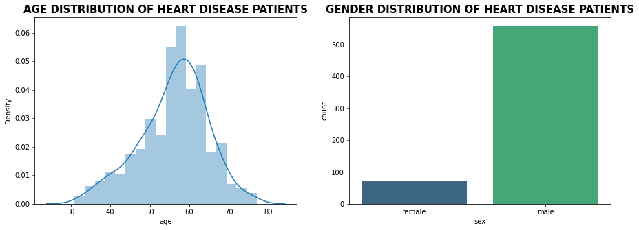
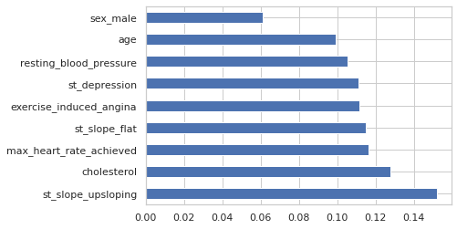

[![LinkedIn][linkedin-shield]][linkedin-url]

<!-- PROJECT LOGO -->
 

  

<h3 align="center">Heart Diease Classification  An End-to-End Machine Learning Project</h3>

  

    Developed and deployed a classifier for heart disease based on over 20 machine learning models, achieving an accuracy of 93.13% using the ExtraTreesClassifier500 model.
    
  

<!-- TABLE OF CONTENTS -->

  
Table of Contents

 <ol>
<li>About the project
<ol>
<li>Dataset Description</li>
<li>Libraries</li>
<li>Data Cleaning &amp; Preprocessing&nbsp;
<ol>
<li>Converting features to catetgorical values</li>
<li>Checking missing values</li>
</ol>
</li>
<li>Exploratory Data Analysis
<ol>
<li>Distribution of heart disease&nbsp;</li>
<li>Gender &amp; Agewise distribution</li>
<li>Chest pain type distribution</li>
<li>ST-Slope Distribution</li>
<li>Numerical features distribution</li>
</ol>
</li>
<li>Outlier Detection &amp; Removal
<ol>
<li>Z-score</li>
<li>Identify &amp; Remove outliers with therdhold =3&nbsp;</li>
<li>Converts categorical data into dummy</li>
<li>Segregate dataset into feature X and target variables y</li>
<li>Check Correlation</li>
</ol>
</li>
<li>&nbsp;Dataset Split &amp; Feature Normalization
<ol>
<li>80/20 Split</li>
<li>Min/Max Scaler</li>
</ol>
</li>
<li>Cross Validation</li>
<li>Model Building</li>
<li>Model Evaluation
<ol>
<li>Best Model</li>
<li>ROC AUC Curve</li>
<li>Precision Recall Curve</li>
<li>Feature Importance&nbsp;</li>
</ol>
</li>
<li>Model Exported</li>
<li>Feature Selections
<ol>
<li>Pearson correlation FS method</li>
<li>Chi-square</li>
<li>Recursive Feature elimination</li>
<li>Embedded Logistic Regression</li>
<li>Embedded Random forest</li>
<li>Embedded Light gbm</li>
<li>Identify &amp; Remove least important features</li>
<li>Split &amp; Feature Normalization</li>
<li>Model Building after feature selection</li>
<li>Model Evaluation after feature selection</li>
<li>Soft Voting</li>
<li>Soft Voting Model Evaluation</li>
<li>Feature Importance</li>
</ol>
</li>
<li>Conclusion&nbsp;</li>
</ol>
</li>
</ol>

<!-- ABOUT THE PROJECT -->
## About The Project

[![Product Name Screen Shot][product-screenshot]](https://example.com)

In today's world, heart disease is one of the leading causes of mortality. Predicting cardiovascular disease is an important challenge in clinical data analysis. Machine learning (ML) has been proven to be effective for making predictions and decisions based on the enormous amount of healthcare data produced each year.  Various studies give only a glimpse into predicting heart disease with ML techniques. 
I developed and deployed a heart disease classifier using over 20 machine learning models, achieving an accuracy of 93.13% with the ExtraTreesClassifier500 model.  As well as using the feature selection method to reduce 15 input variables to 9 variables and using a soft voting classifier, I trained a new model ExtraTreesClassifier1000 with a new accuracy of 92.27% 

(<a href="#readme-top">back to top</a>)

### Dataset Description

&nbsp;

Kaggle's Heart Disease Dataset (Comprehensive) has been used in this project. There are 11 features and a target variable in this dataset. There are 6 nominal variables and 5 numeric variables.

Features variables:

<ol>
<li>Age: Patients Age in years (Numeric)</li>
<li> Sex: Gender of patient (Male &ndash; 1, Female &ndash; 0)&nbsp;</li>
<li> Chest Pain Type: Type of chest pain experienced by patient categorized into 1 typical, 2 typical angina, 3 non-anginal pain, 4 asymptomatic (Nominal)</li>
<li>Resting bp s: Level of blood pressure at resting mode in mm/HG (Numerical)</li>
<li>Cholesterol: Serum cholesterol in mg/dl (Numeric)</li>
<li>Fasting blood sugar: Blood sugar levels on fasting &gt; 120 mg/dl represents 1 in case of true and 0 as false (Nominal)</li>
<li>Resting ecg: Result of an electrocardiogram while at rest are represented in 3 distinct values 0 : Normal 1: Abnormality in ST-T wave 2: Left ventricular hypertrophy (Nominal)</li>
<li>Max heart rate: Maximum heart rate achieved (Numeric)</li>
<li>Exercise angina: Angina induced by exercise 0 depicting NO 1 depicting Yes (Nominal)</li>
<li>Oldpeak: Exercise-induced ST-depression in comparison with the state of rest (Numeric)</li>
<li> ST slope: ST-segment measured in terms of the slope during peak exercise 0: Normal 1: Upsloping 2: Flat 3: Downsloping (Nominal)</li>
</ol>

Target variable

<ol>
<li> target: It is the target variable that we have to predict 1 means the patient is suffering from heart risk and 0 means the patient is norma</li>
</ol>

### Libraries 
This project requires Python 3.8 and the following Python libraries should be installed to get the project started:  

* Numpy
* Pandas
* matplotlib
* scikit-learn
* seaborn
* xgboost

### Data Cleaning & Preprocessing 
* Converting features to catetgorical values
* Checking missing values

### Exploratory Data Analysis
#### Distribution of heart disease 

 
As per the above figure, we can observe that the dataset is balanced having 628 heart disease patients and 561 normal patients.
#### Gender & Agewise distribution
 
As we can see from above plot, in this dataset males percentage is way too higher than females where as average age of patients is around 55.

 
As we can see from above plot more patients accounts for heart disease in comparison to females whereas mean age for heart disease patients is around 58 to 60 years
#### Chest pain type distribution
 
<table id="T_3de82_" class="dataframe">
<thead>
<tr>
<th class="index_name level0">target</th>
<th class="col_heading level0 col0">0</th>
<th class="col_heading level0 col1">1</th>
</tr>
<tr>
<th class="index_name level0">chest_pain_type</th>
<th class="blank col0">&nbsp;</th>
<th class="blank col1">&nbsp;</th>
</tr>
</thead>
<tbody>
<tr>
<th id="T_3de82_level0_row0" class="row_heading level0 row0">asymptomatic</th>
<td id="T_3de82_row0_col0" class="data row0 col0">25.310000</td>
<td id="T_3de82_row0_col1" class="data row0 col1">76.910000</td>
</tr>
<tr>
<th id="T_3de82_level0_row1" class="row_heading level0 row1">non_anginal_pain</th>
<td id="T_3de82_row1_col0" class="data row1 col0">34.400000</td>
<td id="T_3de82_row1_col1" class="data row1 col1">14.170000</td>
</tr>
<tr>
<th id="T_3de82_level0_row2" class="row_heading level0 row2">typical</th>
<td id="T_3de82_row2_col0" class="data row2 col0">7.310000</td>
<td id="T_3de82_row2_col1" class="data row2 col1">3.980000</td>
</tr>
<tr>
<th id="T_3de82_level0_row3" class="row_heading level0 row3">typical_angina</th>
<td id="T_3de82_row3_col0" class="data row3 col0">32.980000</td>
<td id="T_3de82_row3_col1" class="data row3 col1">4.940000</td>
</tr>
</tbody>
</table>
As we can see from the above plot and statistics, 76.91% of the chest pain type of heart disease patients have asymptomatic chest pain.

#### ST-Slope Distribution
 
<table id="T_145b6_" class="dataframe">
<thead>
<tr>
<th class="index_name level0">target</th>
<th class="col_heading level0 col0">0</th>
<th class="col_heading level0 col1">1</th>
</tr>
<tr>
<th class="index_name level0">st_slope</th>
<th class="blank col0">&nbsp;</th>
<th class="blank col1">&nbsp;</th>
</tr>
</thead>
<tbody>
<tr>
<th id="T_145b6_level0_row0" class="row_heading level0 row0">downsloping</th>
<td id="T_145b6_row0_col0" class="data row0 col0">3.920000</td>
<td id="T_145b6_row0_col1" class="data row0 col1">9.390000</td>
</tr>
<tr>
<th id="T_145b6_level0_row1" class="row_heading level0 row1">flat</th>
<td id="T_145b6_row1_col0" class="data row1 col0">21.930000</td>
<td id="T_145b6_row1_col1" class="data row1 col1">73.090000</td>
</tr>
<tr>
<th id="T_145b6_level0_row2" class="row_heading level0 row2">upsloping</th>
<td id="T_145b6_row2_col0" class="data row2 col0">74.150000</td>
<td id="T_145b6_row2_col1" class="data row2 col1">17.520000</td>
</tr>
</tbody>
</table>

&nbsp;

The ST segment /heart rate slope (ST/HR slope), has been proposed as a more accurate ECG criterion for diagnosing significant coronary artery disease (CAD) in most of the research papers.

As we can see from above plot upsloping is positive sign as 74% of the normal patients have upslope where as 73.09% heart patients have flat sloping.

#### Numerical features distribution
 
It is evident from the above plot that heart disease risks increase with age
#### Distribution of Cholesterol vs Resting BP
 
According to the above graph, patients with high cholesterol and high blood pressure are more likely to develop heart disease, whereas those with normal cholesterol and blood pressure do not.

#### Distribution of Age vs Resting BP
  
Using the scatterplot above, we can observe that older patients with blood pressure levels >150 are more likely to develop heart disease than younger patients <50 years of age.

### Outlier Detection & Removal
Outliers are defined as values that are disproportionately large or small compared to the rest of the dataset. 
It may be a result of human error, a change in system behavior, an instrument error, or a genuine error caused by natural deviations in the population. 

  
According to the box plot below, there are some outliers in the following numbers: resting blood pressure, cholesterol, max heart rate and depression. 

##### Z-score

##### Identify & Remove outliers with therdhold =3 
We've set a threshold >3 here, i.e., points that fall a standard deviation beyond 3 will be treated as outliers, big or small.

##### Converts categorical data into dummy
In order to segregate feature and target variables, we must first encode categorical variables as dummy variables and encrypt categorical variables as dummy variables.

##### Segregate dataset into feature X and target variables y & Check Correlation

  Exercise_induced_angina, st_slope_flat, st_depression, and sex_male are all highly positive correlated variables, which means that as their value increases, chances of heart disease increase.  

### Dataset Split & Feature Normalization
#### 80/20 Split
An 80:20 split has been performed, i.e., 80% of the data will be used to train the machine learning model, and the remaining 20% will be used to test it.

---Training Set--- (928, 15) (928,)
---Test Set--- (233, 15) (233,)

Both the training and test sets have a balanced distribution for the target variable.

#### Min/Max Scaler
As we can see in the dataset, many variables have 0,1 values whereas some values have continuous values of different scales which may result in giving higher priority to large-scale values to handle this scenario we have to normalize the features having continuous values in the range of [0,1].

So for normalization, we have used MinMaxScaler for scaling values in the range of [0,1]. Firstly, we have to fit and transform the values on the training set i.e., X_train while for the testing set we have to only transform the values.

### Cross Validation
In order to understand which machine learning model performs well within the training set, we'll do a 10-fold cross-validation.  
For this step, we need to define the machine learning model.  
For this project, we will use more than 20 different machine learning algorithms with varying hyperparameters.   
All machine learning algorithms will be cross-validated 10-fold after the model is defined.

LogisticRegression12: 0.850187 (0.049795)

LinearDiscriminantAnalysis: 0.853436 (0.044442)

KNeighborsClassifier7: 0.846914 (0.043866)

KNeighborsClassifier5: 0.851251 (0.030615)

KNeighborsClassifier9: 0.844811 (0.052060)

KNeighborsClassifier11: 0.844811 (0.038097)

DecisionTreeClassifier: 0.862108 (0.045041)

GaussianNB: 0.848001 (0.050105)

SVC_Linear: 0.849100 (0.048983)

SVC_RBF: 0.857714 (0.052635)

AdaBoostClassifier: 0.851239 (0.048960)

GradientBoostingClassifier: 0.882504 (0.041317)

RandomForestClassifier_Entropy100: 0.914867 (0.032195)

RandomForestClassifier_Gini100: 0.920266 (0.033830)

ExtraTreesClassifier100: 0.909467 (0.038372)

ExtraTreesClassifier500: 0.915930 (0.037674)

MLPClassifier: 0.868478 (0.043864)

SGDClassifier1000: 0.832971 (0.035837)

XGBClassifier2000: 0.911641 (0.032727)

<strong>XGBClassifier500: 0.920278 (0.030163)</strong>

XGBClassifier100: 0.886816 (0.037999)

XGBClassifier1000: 0.915965 (0.034352)

ExtraTreesClassifier1000: 0.912705 (0.037856).

From the above results, it is clear that the **XGBClassifier500** model outperformed others by attaining accuracy of **92.027%**.

### Model Building
Next, we will train all the machine learning models that were cross-validated in the prior step and evaluate their performance on test data.

### Model Evaluation
This step compares the performance of all trained machine learning models.  
To evaluate our model, we must first define which evaluation metrics will be used. 
**F1-measure, ROC AUC curve, and sensitivity, specificity, and precision** are the most important evaluation metrics for classification  
We will also use two additional performance measures, the **Matthews correlation coefficient (MCC) and the Log Loss**, which are more reliable statistical measures.

#### Best Model

<table class="dataframe" border="1">
<thead>
<tr>
<th>&nbsp;</th>
<th>Model</th>
<th>Accuracy</th>
<th>Precision</th>
<th>Sensitivity</th>
<th>Specificity</th>
<th>F1 Score</th>
<th>ROC</th>
<th>Log_Loss</th>
<th>mathew_corrcoef</th>
</tr>
</thead>
<tbody>
<tr>
<th>15</th>
<td>ExtraTreesClassifier500</td>
<td>0.931330</td>
<td>0.906977</td>
<td>0.966942</td>
<td>0.892857</td>
<td>0.936000</td>
<td>0.929900</td>
<td>2.371803</td>
<td>0.864146</td>
</tr>
<tr>
<th>14</th>
<td>ExtraTreesClassifier100</td>
<td>0.927039</td>
<td>0.900000</td>
<td>0.966942</td>
<td>0.883929</td>
<td>0.932271</td>
<td>0.925435</td>
<td>2.520041</td>
<td>0.856002</td>
</tr>
<tr>
<th>18</th>
<td>XGBClassifier2000</td>
<td>0.922747</td>
<td>0.905512</td>
<td>0.950413</td>
<td>0.892857</td>
<td>0.927419</td>
<td>0.921635</td>
<td>2.668273</td>
<td>0.846085</td>
</tr>
<tr>
<th>22</th>
<td>ExtraTreesClassifier1000</td>
<td>0.922747</td>
<td>0.893130</td>
<td>0.966942</td>
<td>0.875000</td>
<td>0.928571</td>
<td>0.920971</td>
<td>2.668280</td>
<td>0.847907</td>
</tr>
<tr>
<th>21</th>
<td>XGBClassifier1000</td>
<td>0.918455</td>
<td>0.898438</td>
<td>0.950413</td>
<td>0.883929</td>
<td>0.923695</td>
<td>0.917171</td>
<td>2.816511</td>
<td>0.837811</td>
</tr>
<tr>
<th>12</th>
<td>RandomForestClassifier_Entropy100</td>
<td>0.918455</td>
<td>0.880597</td>
<td>0.975207</td>
<td>0.857143</td>
<td>0.925490</td>
<td>0.916175</td>
<td>2.816522</td>
<td>0.841274</td>
</tr>
<tr>
<th>13</th>
<td>RandomForestClassifier_Gini100</td>
<td>0.918455</td>
<td>0.880597</td>
<td>0.975207</td>
<td>0.857143</td>
<td>0.925490</td>
<td>0.916175</td>
<td>2.816522</td>
<td>0.841274</td>
</tr>
<tr>
<th>19</th>
<td>XGBClassifier500</td>
<td>0.914163</td>
<td>0.897638</td>
<td>0.942149</td>
<td>0.883929</td>
<td>0.919355</td>
<td>0.913039</td>
<td>2.964746</td>
<td>0.828834</td>
</tr>
<tr>
<th>20</th>
<td>XGBClassifier100</td>
<td>0.871245</td>
<td>0.876033</td>
<td>0.876033</td>
<td>0.866071</td>
<td>0.876033</td>
<td>0.871052</td>
<td>4.447104</td>
<td>0.742104</td>
</tr>
<tr>
<th>6</th>
<td>DecisionTreeClassifier</td>
<td>0.866953</td>
<td>0.846154</td>
<td>0.909091</td>
<td>0.821429</td>
<td>0.876494</td>
<td>0.865260</td>
<td>4.595356</td>
<td>0.734925</td>
</tr>
<tr>
<th>11</th>
<td>GradientBoostingClassifier</td>
<td>0.862661</td>
<td>0.861789</td>
<td>0.876033</td>
<td>0.848214</td>
<td>0.868852</td>
<td>0.862124</td>
<td>4.743581</td>
<td>0.724836</td>
</tr>
<tr>
<th>16</th>
<td>MLPClassifier</td>
<td>0.858369</td>
<td>0.843750</td>
<td>0.892562</td>
<td>0.821429</td>
<td>0.867470</td>
<td>0.856995</td>
<td>4.891827</td>
<td>0.716959</td>
</tr>
<tr>
<th>10</th>
<td>AdaBoostClassifier</td>
<td>0.854077</td>
<td>0.853659</td>
<td>0.867769</td>
<td>0.839286</td>
<td>0.860656</td>
<td>0.853527</td>
<td>5.040055</td>
<td>0.707629</td>
</tr>
<tr>
<th>9</th>
<td>SVC_RBF</td>
<td>0.828326</td>
<td>0.818898</td>
<td>0.859504</td>
<td>0.794643</td>
<td>0.838710</td>
<td>0.827073</td>
<td>5.929483</td>
<td>0.656330</td>
</tr>
<tr>
<th>4</th>
<td>KNeighborsClassifier9</td>
<td>0.828326</td>
<td>0.813953</td>
<td>0.867769</td>
<td>0.785714</td>
<td>0.840000</td>
<td>0.826741</td>
<td>5.929486</td>
<td>0.656787</td>
</tr>
<tr>
<th>2</th>
<td>KNeighborsClassifier5</td>
<td>0.824034</td>
<td>0.822581</td>
<td>0.842975</td>
<td>0.803571</td>
<td>0.832653</td>
<td>0.823273</td>
<td>6.077714</td>
<td>0.647407</td>
</tr>
<tr>
<th>8</th>
<td>SVC_Linear</td>
<td>0.819742</td>
<td>0.811024</td>
<td>0.851240</td>
<td>0.785714</td>
<td>0.830645</td>
<td>0.818477</td>
<td>6.225956</td>
<td>0.639080</td>
</tr>
<tr>
<th>1</th>
<td>LinearDiscriminantAnalysis</td>
<td>0.815451</td>
<td>0.809524</td>
<td>0.842975</td>
<td>0.785714</td>
<td>0.825911</td>
<td>0.814345</td>
<td>6.374191</td>
<td>0.630319</td>
</tr>
<tr>
<th>0</th>
<td>LogisticRegression12</td>
<td>0.815451</td>
<td>0.804688</td>
<td>0.851240</td>
<td>0.776786</td>
<td>0.827309</td>
<td>0.814013</td>
<td>6.374195</td>
<td>0.630637</td>
</tr>
<tr>
<th>3</th>
<td>KNeighborsClassifier7</td>
<td>0.811159</td>
<td>0.808000</td>
<td>0.834711</td>
<td>0.785714</td>
<td>0.821138</td>
<td>0.810213</td>
<td>6.522426</td>
<td>0.621619</td>
</tr>
<tr>
<th>7</th>
<td>GaussianNB</td>
<td>0.811159</td>
<td>0.798450</td>
<td>0.851240</td>
<td>0.767857</td>
<td>0.824000</td>
<td>0.809548</td>
<td>6.522433</td>
<td>0.622227</td>
</tr>
<tr>
<th>5</th>
<td>KNeighborsClassifier11</td>
<td>0.811159</td>
<td>0.793893</td>
<td>0.859504</td>
<td>0.758929</td>
<td>0.825397</td>
<td>0.809216</td>
<td>6.522437</td>
<td>0.622814</td>
</tr>
<tr>
<th>17</th>
<td>SGDClassifier1000</td>
<td>0.776824</td>
<td>0.719745</td>
<td>0.933884</td>
<td>0.607143</td>
<td>0.812950</td>
<td>0.770514</td>
<td>7.708376</td>
<td>0.576586</td>
</tr>
</tbody>
</table>

**The ExtraTreesClassifier500 is the best performer among all the models based on the results above** 

<table class="dataframe" style="width: 722px;" border="1">
<thead>
<tr>
<th style="width: 15.6406px;">&nbsp;</th>
<th style="width: 128.359px;">Model</th>
<th style="width: 55px;">Accuracy</th>
<th style="width: 56px;">Precision</th>
<th style="width: 65px;">Sensitivity</th>
<th style="width: 63px;">Specificity</th>
<th style="width: 53px;">F1 Score</th>
<th style="width: 52px;">ROC</th>
<th style="width: 57px;">Log_Loss</th>
<th style="width: 108px;">mathew_corrcoef</th>
</tr>
</thead>
<tbody>
<tr>
<th style="width: 15.6406px;">15</th>
<td style="width: 128.359px;">ExtraTreesClassifier500</td>
<td style="width: 55px;">0.931330</td>
<td style="width: 56px;">0.906977</td>
<td style="width: 65px;">0.966942</td>
<td style="width: 63px;">0.892857</td>
<td style="width: 53px;">0.936000</td>
<td style="width: 52px;">0.929900</td>
<td style="width: 57px;">2.371803</td>
<td style="width: 108px;">0.864146</td>
</tr>
</tbody>
</table>

#### Feature Importance 

### Feature Selections
#### Identify & Remove least important features
Feature selection (FS) is the process of removing irrelevant and redundant features from the dataset to reduce training time, build simple models, and interpret the features. 
In this project, we have used two filter-based FS techniques: 
* Pearson Correlation Coefficient  
* Chi-square. 

One wrapper-based FS: 
* Recursive Feature Elimination.

And three embedded FS methods: 
* Embedded logistic regression 
* Embedded random forest 
* Embedded Light GBM.
  
<table class="dataframe" border="1">
<thead>
<tr>
<th>&nbsp;</th>
<th>Feature</th>
<th>Pearson</th>
<th>Chi-2</th>
<th>RFE</th>
<th>Logistics</th>
<th>Random Forest</th>
<th>LightGBM</th>
<th>Total</th>
</tr>
</thead>
<tbody>
<tr>
<th>1</th>
<td>st_slope_flat</td>
<td>True</td>
<td>True</td>
<td>True</td>
<td>True</td>
<td>True</td>
<td>True</td>
<td>6</td>
</tr>
<tr>
<th>2</th>
<td>st_depression</td>
<td>True</td>
<td>True</td>
<td>True</td>
<td>True</td>
<td>True</td>
<td>True</td>
<td>6</td>
</tr>
<tr>
<th>3</th>
<td>cholesterol</td>
<td>True</td>
<td>True</td>
<td>True</td>
<td>True</td>
<td>True</td>
<td>True</td>
<td>6</td>
</tr>
<tr>
<th>4</th>
<td>resting_blood_pressure</td>
<td>True</td>
<td>True</td>
<td>True</td>
<td>False</td>
<td>True</td>
<td>True</td>
<td>5</td>
</tr>
<tr>
<th>5</th>
<td>max_heart_rate_achieved</td>
<td>True</td>
<td>True</td>
<td>True</td>
<td>False</td>
<td>True</td>
<td>True</td>
<td>5</td>
</tr>
<tr>
<th>6</th>
<td>exercise_induced_angina</td>
<td>True</td>
<td>True</td>
<td>True</td>
<td>False</td>
<td>True</td>
<td>True</td>
<td>5</td>
</tr>
<tr>
<th>7</th>
<td>age</td>
<td>True</td>
<td>True</td>
<td>True</td>
<td>False</td>
<td>True</td>
<td>True</td>
<td>5</td>
</tr>
<tr>
<th>8</th>
<td>st_slope_upsloping</td>
<td>True</td>
<td>True</td>
<td>True</td>
<td>False</td>
<td>True</td>
<td>False</td>
<td>4</td>
</tr>
<tr>
<th>9</th>
<td>sex_male</td>
<td>True</td>
<td>True</td>
<td>True</td>
<td>True</td>
<td>False</td>
<td>False</td>
<td>4</td>
</tr>
<tr>
<th>10</th>
<td>chest_pain_type_typical_angina</td>
<td>True</td>
<td>True</td>
<td>True</td>
<td>True</td>
<td>False</td>
<td>False</td>
<td>4</td>
</tr>
<tr>
<th>11</th>
<td>chest_pain_type_typical</td>
<td>True</td>
<td>True</td>
<td>True</td>
<td>True</td>
<td>False</td>
<td>False</td>
<td>4</td>
</tr>
<tr>
<th>12</th>
<td>chest_pain_type_non_anginal_pain</td>
<td>True</td>
<td>True</td>
<td>True</td>
<td>True</td>
<td>False</td>
<td>False</td>
<td>4</td>
</tr>
<tr>
<th>13</th>
<td>rest_ecg_st_t_wave_abnormality</td>
<td>True</td>
<td>True</td>
<td>True</td>
<td>False</td>
<td>False</td>
<td>False</td>
<td>3</td>
</tr>
<tr>
<th>14</th>
<td>rest_ecg_normal</td>
<td>True</td>
<td>True</td>
<td>True</td>
<td>False</td>
<td>False</td>
<td>False</td>
<td>3</td>
</tr>
<tr>
<th>15</th>
<td>fasting_blood_sugar</td>
<td>True</td>
<td>True</td>
<td>True</td>
<td>False</td>
<td>False</td>
<td>False</td>
<td>3</td>
</tr>
</tbody>
</table>
  
  As a result, we will now select only the top 9 features. Our machine learning models will be retrained with these 9 selected features and their performance will be compared to see if there is an improvement.

#### Soft Voting & Model Evaluation
**Top 5 classifers after features selection**
<table class="dataframe" border="1">
<thead>
<tr>
<th>&nbsp;</th>
<th>Model</th>
<th>Accuracy</th>
<th>Precision</th>
<th>Sensitivity</th>
<th>Specificity</th>
<th>F1 Score</th>
<th>ROC</th>
<th>Log_Loss</th>
<th>mathew_corrcoef</th>
</tr>
</thead>
<tbody>
<tr>
<th>15</th>
<td>ExtraTreesClassifier500</td>
<td>0.918455</td>
<td>0.880597</td>
<td>0.975207</td>
<td>0.857143</td>
<td>0.925490</td>
<td>0.916175</td>
<td>2.816522</td>
<td>0.841274</td>
</tr>
<tr>
<th>22</th>
<td>ExtraTreesClassifier1000</td>
<td>0.914163</td>
<td>0.879699</td>
<td>0.966942</td>
<td>0.857143</td>
<td>0.921260</td>
<td>0.912043</td>
<td>2.964757</td>
<td>0.831855</td>
</tr>
<tr>
<th>18</th>
<td>XGBClassifier2000</td>
<td>0.914163</td>
<td>0.879699</td>
<td>0.966942</td>
<td>0.857143</td>
<td>0.921260</td>
<td>0.912043</td>
<td>2.964757</td>
<td>0.831855</td>
</tr>
<tr>
<th>14</th>
<td>ExtraTreesClassifier100</td>
<td>0.914163</td>
<td>0.879699</td>
<td>0.966942</td>
<td>0.857143</td>
<td>0.921260</td>
<td>0.912043</td>
<td>2.964757</td>
<td>0.831855</td>
</tr>
<tr>
<th>12</th>
<td>RandomForestClassifier_Entropy100</td>
<td>0.914163</td>
<td>0.874074</td>
<td>0.975207</td>
<td>0.848214</td>
<td>0.921875</td>
<td>0.911710</td>
<td>2.964760</td>
<td>0.833381</td>
</tr>
</tbody>
</table>

&nbsp;

**Soft Voting Classifier**
<table class="dataframe" border="1">
<thead>
<tr>
<th>&nbsp;</th>
<th>Model</th>
<th>Accuracy</th>
<th>Precision</th>
<th>Sensitivity</th>
<th>Specificity</th>
<th>F1 Score</th>
<th>ROC</th>
<th>Log_Loss</th>
<th>mathew_corrcoef</th>
</tr>
</thead>
<tbody>
<tr>
<th>0</th>
<td>Soft Voting</td>
<td>0.914163</td>
<td>0.879699</td>
<td>0.966942</td>
<td>0.857143</td>
<td>0.921260</td>
<td>0.912043</td>
<td>2.964757</td>
<td>0.831855</td>
</tr>
</tbody>
</table>

&nbsp;

**Top 5 final classifier after feature selections**
<table class="dataframe" border="1">
<thead>
<tr style="height: 13px;">
<th style="height: 13px;">&nbsp;</th>
<th style="height: 13px;">Model</th>
<th style="height: 13px;">Accuracy</th>
<th style="height: 13px;">Precision</th>
<th style="height: 13px;">Sensitivity</th>
<th style="height: 13px;">Specificity</th>
<th style="height: 13px;">F1 Score</th>
<th style="height: 13px;">ROC</th>
<th style="height: 13px;">Log_Loss</th>
<th style="height: 13px;">mathew_corrcoef</th>
</tr>
</thead>
<tbody>
<tr style="height: 13px;">
<th style="height: 13px;">22</th>
<td style="height: 13px;">ExtraTreesClassifier1000</td>
<td style="height: 13px;">0.922747</td>
<td style="height: 13px;">0.887218</td>
<td style="height: 13px;">0.975207</td>
<td style="height: 13px;">0.866071</td>
<td style="height: 13px;">0.929134</td>
<td style="height: 13px;">0.920639</td>
<td style="height: 13px;">2.668283</td>
<td style="height: 13px;">0.849211</td>
</tr>
<tr style="height: 13px;">
<th style="height: 13px;">14</th>
<td style="height: 13px;">ExtraTreesClassifier100</td>
<td style="height: 13px;">0.922747</td>
<td style="height: 13px;">0.887218</td>
<td style="height: 13px;">0.975207</td>
<td style="height: 13px;">0.866071</td>
<td style="height: 13px;">0.929134</td>
<td style="height: 13px;">0.920639</td>
<td style="height: 13px;">2.668283</td>
<td style="height: 13px;">0.849211</td>
</tr>
<tr style="height: 13px;">
<th style="height: 13px;">18</th>
<td style="height: 13px;">XGBClassifier2000</td>
<td style="height: 13px;">0.914163</td>
<td style="height: 13px;">0.879699</td>
<td style="height: 13px;">0.966942</td>
<td style="height: 13px;">0.857143</td>
<td style="height: 13px;">0.921260</td>
<td style="height: 13px;">0.912043</td>
<td style="height: 13px;">2.964757</td>
<td style="height: 13px;">0.831855</td>
</tr>
<tr style="height: 13px;">
<th style="height: 13px;">15</th>
<td style="height: 13px;">ExtraTreesClassifier500</td>
<td style="height: 13px;">0.914163</td>
<td style="height: 13px;">0.879699</td>
<td style="height: 13px;">0.966942</td>
<td style="height: 13px;">0.857143</td>
<td style="height: 13px;">0.921260</td>
<td style="height: 13px;">0.912043</td>
<td style="height: 13px;">2.964757</td>
<td style="height: 13px;">0.831855</td>
</tr>
<tr style="height: 13px;">
<th style="height: 13px;">0</th>
<td style="height: 13px;">Soft Voting</td>
<td style="height: 13px;">0.914163</td>
<td style="height: 13px;">0.879699</td>
<td style="height: 13px;">0.966942</td>
<td style="height: 13px;">0.857143</td>
<td style="height: 13px;">0.921260</td>
<td style="height: 13px;">0.912043</td>
<td style="height: 13px;">2.964757</td>
<td style="height: 13px;">0.831855</td>
</tr>
</tbody>
</table>

&nbsp;

&nbsp;

#### Feature important

# Conclusion
<ul>
<li>As part of this project, we analyzed the Heart Disease Dataset (Comprehensive) and performed detailed data analysis and data processing.</li>
<li>A total of more than 20 machine learning models were trained and evaluated, and their performance was compared and found that the ExtraTreesClassifier500 model with entropy criteria performed better than the others with an accuracy of 93.13 percent.</li>
<li>We have also implemented a majority vote feature selection method that involves two filter-based, one wrapper-based, and three embedded feature selection methods.</li>
<li>As a result of feature selection, ExtraTreesClassifier1000 performs at the highest level of accuracy with a 92.27% accuracy rate, which is less than 1% lower than its accuracy before feature selection.</li>
<li>Based on feature importance plots, ST-Slope, cholesterol and maximum heart rate achieved contributed the most</li>
</ul>

&nbsp;

